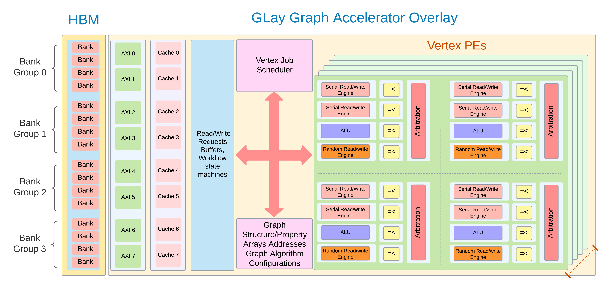
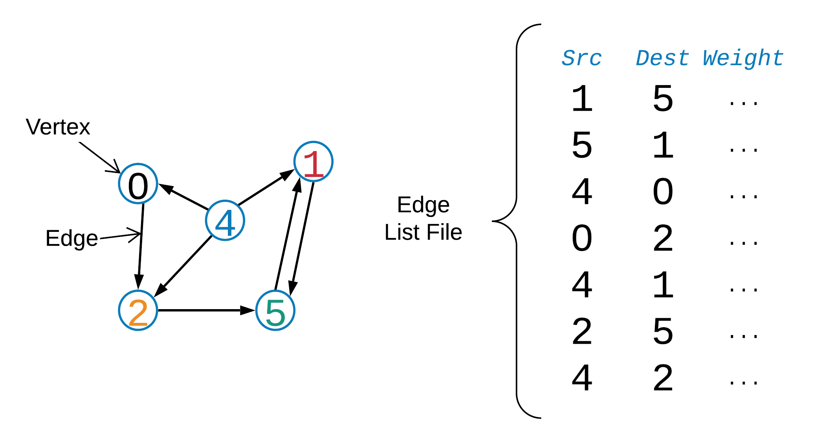
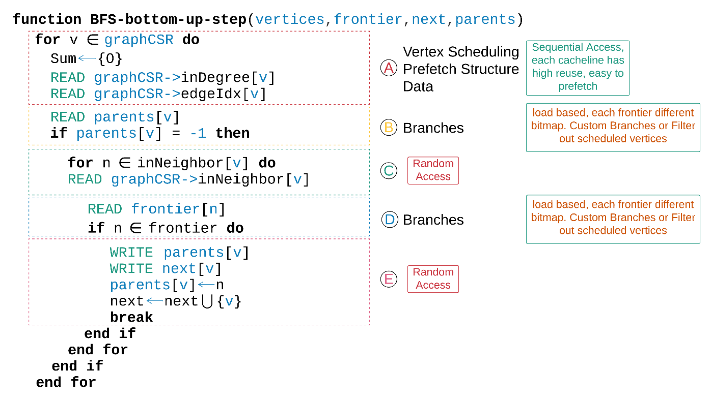
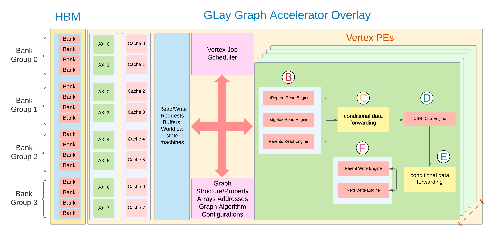
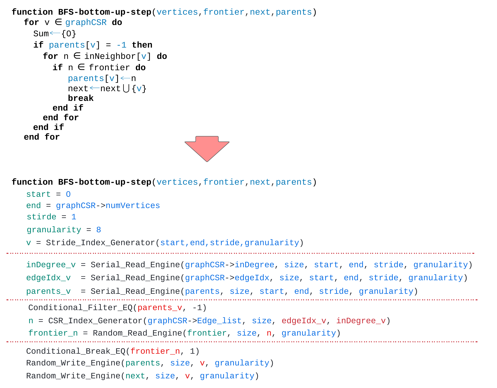

[](https://app.travis-ci.com/atmughrabi/GLay)
[<p align="center"></p>](#GLay-benchmark-suite)

GLay: A Vertex Centric Re-Configurable Graph Processing Overlay
===============================================================

Abstract
--------

FPGA reconfiguration time between accelerated graph processing
algorithms is becoming a top priority requirement. It is of prime
importance to rethink today\'s graph algorithm acceleration design on
FPGAs for faster reconfiguration between algorithms while maintaining
execution performance and custom memory optimizations. For instance, the
reconfiguration of the FPGA graph processing algorithms causes
substantial pauses to reprogram the FPGA chip when switching from one
graph algorithm to another, affecting the algorithm\'s critical path and
performance. Such a paradigm heavily exists in virtual systems that
demand generic support for graph processing to cover a wide range of
use-cases while being managed efficiently by the hypervisor. In this
work, we propose a coarse-grain overlay for graph processing GLay. This
overlay extracts the typical access patterns in many graph algorithms
and abstracts them into domain-specific graph Processing Elements (PE)
interconnect. Compared to the classical FPGA ms-s reconfiguration time,
GLay achieves ns-us reconfiguration time between graph algorithms. While
maintaining the performance and power optimizations, an FPGA provides.

 Contributions")

# GLay Benchmark Suite

## Overview



* Presentations that explains end-to-end graph processing (implementation is inspired from these sources)
  * Preprocessing two steps (third one is optional) :
    1. [[Sorting the edge-list](./02_slides_figures_docs/02_preprocessing_countsort.pdf)], using count-sort or radix-sort.
    2. [[Building the graph structure](./02_slides_figures_docs/03_preprocessing_DataStructures.pdf)]. CSR, Gird, Adjacency-Linked-List, and Adjacency-Array-List.
        * [Ref](https://github.com/thu-pacman/GridGraph): Xiaowei Zhu, Wentao Han and Wenguang Chen. [GridGraph: Large-Scale Graph Processing on a Single Machine Using 2-Level Hierarchical Partitioning](https://www.usenix.org/system/files/conference/atc15/atc15-paper-zhu.pdf). Proceedings of the 2015 USENIX Annual Technical Conference, pages 375-386.
        * [Ref](https://github.com/epfl-labos/EverythingGraph): Malicevic, Jasmina, Baptiste Lepers, and Willy Zwaenepoel. "Everything you always wanted to know about multicore graph processing but were afraid to ask." 2017 USENIX Annual Technical Conference. Proceedings of the 2015 USENIX Annual Technical Conference, pages 375-386.
    3. [[Relabeling the graph](./02_slides_figures_docs/01_algorithm_PR_cache.pdf)], this step achieves better cache locality (better performance) with preprocessing overhead.
        * [Ref](https://github.com/araij/rabbit_order): J. Arai, H. Shiokawa, T. Yamamuro, M. Onizuka, and S. Iwamura. Rabbit Order: Just-in-time Parallel Reordering for Fast Graph Analysis. IEEE International Parallel and Distributed Processing Symposium (IPDPS), 2016.
        * [Ref](https://github.com/faldupriyank/dbg):P. Faldu and J. Diamond and B. Grot, "A Closer Look at Lightweight Graph Reordering," in Proceedings of the International Symposium on Workload Characterization (IISWC), November 2019.
  * Graph Algorithm step depends on the direction of the data (Push/Pull):
    1. [[BFS example](./02_slides_figures_docs/00_algorithm_BFS.pdf)], although it doesn't show direction optimized. But we discusses the Push and Pull approach separately.
        * [[Ref](https://github.com/sbeamer/gapbs)]: Scott Beamer, Krste Asanović, David Patterson. [The GAP Benchmark Suite](http://arxiv.org/abs/1508.03619). arXiv:1508.03619 [cs.DC], 2015.
    2. [[Page-Rank (PR) example](./02_slides_figures_docs/01_algorithm_PR_cache.pdf)]: Discussing PR cache behavior.
       * [Ref](https://github.com/araij/rabbit_order): J. Arai, H. Shiokawa, T. Yamamuro, M. Onizuka, and S. Iwamura. Rabbit Order: Just-in-time Parallel Reordering for Fast Graph Analysis. IEEE International Parallel and Distributed Processing Symposium (IPDPS), 2016.

# Installation and Dependencies

## Xilinx Dependencies

The designs have been verified with the following software/hardware environment and tool chain versions:
* Operating Systems:
  * Ubuntu 18.04/20.04 (See [Additional Requirements for Ubuntu](#cpu-dependencies))
  * Perl package installed for Verilog simulation (**required**)
  * GCC 7
* Vitis: 2022.1
* XRT: 2.13.466
* Hardware and Platform for your Alveo card (you need both the deployment and development platforms):
  * Alveo U250: xilinx_u250_gen3x16_xdma_4_1_202210_1 (**Currently Supported**)
  * Alveo U250: xilinx_u280_gen3x16_xdma_1_202211_1

## CPU Dependencies

### OpenMP

1. Judy Arrays
```console
user@host:~$ sudo apt-get install libjudy-dev
```
2. OpenMP is already a feature of the compiler, so this step is not necessary.
```console
user@host:~$ sudo apt-get install libomp-dev
```

## Setting up the source code

1. Clone GLay.
```console
user@host:~$ git clone https://github.com/atmughrabi/GLay.git
```
2. From the home directory go to the GLay directory:
```console
user@host:~$ cd GLay/
```
3. Make the source code
```console
user@host:~GLay$ make
```

# Running GLay (Under construction!)

## Xilinx Flow [](https://xilinx.github.io/XRT/2022.1/html/index.html)

* You can pass parameters or modify `Makefile` parameters (easiest way) at GLay root directory, to control the FPGA development flow and support.

| PARAMETER  | VALUE | FUNCTION |
| :--- | :--- | :--- |
| PART  | xcu250-figd2104-2L-e | Part matching u250 Alveo card |
| PLATFORM  | xilinx_u250_gen3x16_xdma_4_1_202210_1 | Platform matching u250 Alveo card |
| TARGET  | hw_emu | Build target hw or hw_emu |
| XILINX_CTRL_MODE  | user_managed | ctrl mode, ap_ctrl_hs or ap_ctrl_chain |

### Simulation Mode

1. Generate Xilinx IPs:
```console
user@host:~GLay$ make gen-vip
```
2. Run simulation on xsim:
```console
user@host:~GLay$ make run-sim
```
3. View simulation waves:
```console
user@host:~GLay$ make run-sim-wave
```
### Hardware Emulation Mode (TARGET=hw_emu)

1. Generate Xilinx IPs:
```console
user@host:~GLay$ make gen-vip
```
2. Package GLay kernel:
```console
user@host:~GLay$ make package-kernel
```
3. Build binary for emulation:
```console
user@host:~GLay$ make build-hw TARGET=hw_emu
```
4. Run GLay on emulated hw:
```console
user@host:~GLay$ make run-emu
```
5. View emulation waves:
```console
user@host:~GLay$ make run-emu-wave
```
### Hardware Mode (TARGET=hw)

1. Generate Xilinx IPs:
```console
user@host:~GLay$ make gen-vip
```
2. Package GLay kernel:
```console
user@host:~GLay$ make package-kernel
```
3. Build binary for FPGA:
```console
user@host:~GLay$ make build-hw TARGET=hw
```
4. Run GLay on taget fgpa:
```console
user@host:~GLay$ make run-fpga
```
#### Generate reports in hardware mode (TARGET=hw)

1. Generate Timing, Resource utilization and power reports:
```console
user@host:~GLay$ make report_metrics 
```

#### Open Project in Vivado GUI hardware or emulation mode (TARGET=hw/hw_emu)

1. Generate Vivado project:
```console
user@host:~GLay$ make open-vivado-project
```

## CPU Flow [](https://www.openmp.org/)

### Initial compilation for the Graph framework with OpenMP

1. The default compilation is `openmp` mode:
```console
user@host:~GLay$ make
```
2. From the root directory you can modify the Makefile with the [(parameters)](#GLay-options) you need for OpenMP:
```console
user@host:~GLay$ make run
```
* You can pass parameters modifying `Makefile` parameters (easiest way) - cross reference with [(parameters)](#GLay-options) to pass the correct values.


| PARAMETER  | FUNCTION | 
| :--- | :--- |
| ARGS  | arguments passed to glay |

| PARAMETER  | FUNCTION | 
| :--- | :--- |
| *Graph Files Directory* |
| FILE_BIN  | graph edge-list location |
| FILE_LABEL  | graph edge-list reorder list | 

| PARAMETER  | FUNCTION | 
| :--- | :--- |
| *Graph Structures PreProcessing* |
| SORT_TYPE  | graph edge-list sort (count/radix) |
| DATA_STRUCTURES  | CSR,Segmented |
| REORDER_LAYER1  | Reorder graph for cache optimization |

| PARAMETER  | FUNCTION | 
| :--- | :--- |
| *Algorithms General* |
| ALGORITHMS  | BFS, PR, DFS, etc |
| PULL_PUSH  | Direction push,pull,hybrid |

| PARAMETER  | FUNCTION | 
| :--- | :--- |
| *Algorithms Specific* |
| ROOT  | source node for BFS, etc |
| TOLERANCE  | PR tolerance for convergence |
| NUM_ITERATIONS  | PR iterations or convergence |
| DELTA  | SSSP delta step |

| PARAMETER  | FUNCTION | 
| :--- | :--- |
| *General Performance* |
| NUM_THREADS_PRE  | number of threads for the preprocess step (graph sorting, generation) |
| NUM_THREADS_ALGO  | number of threads for the algorithm step (BFS,PR, etc) |
| NUM_THREADS_KER  | (Optional) number of threads for the algorithm kernel (BFS,PR, etc) |
| NUM_TRIALS  | number of trials for the same algorithms | 


# Graph structure Input (Edge list)

* If you open the Makefile you will see the convention for graph directories : `BENCHMARKS_DIR/GRAPH_NAME/graph.wbin`.
* `.bin` stands to unweighted edge list, `.wbin` stands for wighted, `In binary format`. (This is only a convention you don't have to use it)
* The reason behind converting the edge-list from text to binary, it is simply takes less space on the drive for large graphs, and easier to use with the `mmap` function.

| Source  | Dest | Weight (Optional) |
| :---: | :---: | :---: |
| 30  | 3  |  1 |
| 3  | 4  |  1 |

* Example:
* INPUT: (unweighted textual edge-list)
* ../BENCHMARKS_DIR/GRAPH_NAME/graph
 ```
  30    3
  3     4
  25    5
  25    7
  6     3
  4     2
  6     12
  6     8
  6     11
  8     22
  9     27

 ```
* convert to binary format and add random weights, for this example all the weights are `1`.
* `--graph-file-format` is the type of graph you are reading, `--convert-format` is the type of format you are converting to.
* NOTE: you can read the file from text format without the convert step. By adding `--graph-file-format 0` to the argument list. The default is `1` assuming it is binary. please check `--help` for better explanation.
* `--stats` is a flag that enables conversion. It used also for collecting stats about the graph (but this feature is on hold for now).
* (unweighted graph)
```console
user@host:~GLay$ make convert
```
* OR (weighted graph)
```console
user@host:~GLay$ make convert-w
```
* OR (weighted graph)
```console
user@host:~GLay$ ./bin/glay-openmp  --generate-weights --stats --graph-file-format=0 --convert-format=1 --graph-file=../BENCHMARKS_DIR/GRAPH_NAME/graph
```

* `Makefile` parameters

| PARAMETER  | FUNCTION | 
| :--- | :--- |
| *File Formats* |
| FILE_FORMAT  | the type of graph read |
| CONVERT_FORMAT  | the type of graph converted |


* OUTPUT: (weighted binary edge-list)
*  ../BENCHMARKS_DIR/GRAPH_NAME/graph.wbin
```
1e00 0000 0300 0000 0100 0000 0300 0000
0400 0000 0100 0000 1900 0000 0500 0000
0100 0000 1900 0000 0700 0000 0100 0000
0600 0000 0300 0000 0100 0000 0400 0000
0200 0000 0100 0000 0600 0000 0c00 0000
0100 0000 0600 0000 0800 0000 0100 0000
0600 0000 0b00 0000 0100 0000 0800 0000
1600 0000 0100 0000 0900 0000 1b00 0000
0100 0000
```

# Graph Structure Preprocessing:
GLay can handle multiple representations of the graph structure in memory, each has their own theoretical benefits and shortcomings.

## Regular unsorted Edge-list as input.
<p align="center"></p>

##  CSR (Compressed Sparse Row)
<p align="center"></p>

##  CSR Segmented Format
<p align="center"></p>

Identifying Access Patterns and Control Flow in Graph Algorithms
----------------------------------------------------------------

Graph processing kernels share common behaviors. GLay's primary purpose
is to abstract such access flows into engines for faster programmability
between graph algorithms instead of having a fixed accelerator. Such
overlay architecture reduces the reconfiguration time from typical FPGA
flow, taking ms-s into ns-us. Figure 3 and Figure 4 highlight the
Breadth-First Search (BFS) bottom-up approach graph algorithm
analysis and its correlation to the GLay architecture design. For
instance, a graph algorithm needs to interact with the graph structure
commonly represented in the Compressed Sparse Row Matrix (CSR), as shown
in Figure 2. Such behaviors are abstracted into sequential accesses and
usually relate to accessing the graph CSR structure data, for example,
the degree, vertex offset data, and the neighbor list for the processed
vertex as shown in Figure 4 step A.

As illustrated in steps C and E, the graph property data is most often
accessed randomly and has high cache miss rates. Both behaviors will be
supported and optimized with specialized read/write engines in GLay
architecture. Other behaviors such as mathematical operations and
branches are kept in a dataflow approach. As each vertex read/write
request is filtered or processed based on a conditional reprogrammable
module for each engine, while an ALU handles simple mathematical
operations if needed. Figure 4 displays the final analysis for BFS and
the proposed Processing Elements (PEs).

 structure")


 algorithm")





 for graph processing kernels.")


GLay Architecture 
------------------

Figure 5 illustrates an abstract overview of GLay vertex-centric graph
processing overlay. The Vertex CU supports multiple programmable engines
and processing elements (PEs). These engines and PEs are bundled within
the Vertex CU, where each PE bundle is pipelined in a step manner. A PE
bundle contains read/write engines, conditional modules, ALU, and
arbitration units to forward the data to the next cluster.

Vertex CU clusters are hierarchically grouped for scalability, where
each set is handled by a level of arbitration that forwards/receives
commands from the memory interfaces. Vertex property data reuse or
atomic instruction is forwarded to the CXL interface cache. In contrast,
structure data or read-only data with low reuse are utilized via HBM.
Furthermore, a simple caching mechanism is provided on-chip for
read-only data with high reuse to enhance response time and reduce the
pressure on the HBM/CXL interfaces.

Figure 4 and Figure 6 showcase how BFS maps on each Vertex CU, step-A
vertex-IDs are scheduled to each CU and processed in a vertex-centric
manner. The first PE bundle is configured for step B to read the CSR
offset and other structural data. The conditional statement filters the
vertices visited from the next PE bundle in step C. Next, step D read
the graph neighbor list from the CSR structure. Finally, in steps E and
F, a conditional break halts the engine from processing the vertex
neighbor list and updates the frontier data.



GLay Graph Description Language (GGDL)
======================================

GGDL is a description language that helps compile and port any graph
algorithm to GLay graph processing overlay. This chapter describes some
of the features of GLay architecture combined with a description
language that can be compiled to reprogram the graph overlay.

Serial\_Read\_Engine
--------------------

### Input :array\_pointer, array\_size, start\_read, end\_read, stride, granularity

The serial read engine sends read commands to the memory control layer.
Each read or write requests a chunk of data specified with the
"granularity" parameter -- alignment should be honored for a cache line.
The "stride" parameter sets the offset taken by each consecutive read;
strides should also honor alignment restrictions. This behavior is
related to reading CSR structure data, for example, reading the offsets
array.

Serial\_Write\_Engine
---------------------

### Input :array\_pointer, array\_size, index, granularity

The serial write engine sends coalesced write commands to the memory
control layer. Each write-request groups a chunk of data (group of
vertices) intended to be written in a serial pattern. The serial write
engine is simpler to design as it plans only to group serial data and
write them in single bursts depending on the "granularity" parameter.
This behavior can be found in iterative SpMV-based graph algorithms like
PageRank.

Random\_Read\_Engine / Random\_Write\_Engine
--------------------------------------------

### Input: array\_pointer, array\_size, index, granularity

A random read engine does not require a stride access pattern. Instead,
arbitrary fine-grain commands are sent straight to a caching element in
a fine-grained manner. Optimizations can occur on the caching level with
grouping or reordering. The main challenge would be designing an engine
that supports fine-grain accesses while balancing the design complexity
if such optimizations were to be kept.

Stride\_Index\_Generator
------------------------

### Input: index\_start, index\_end, stride, granularity

The stride index generator serves two purposes. First, it generates a
sequence of indices or Vertex-IDs scheduled to the Vertex Compute Units
(CUs). For each Vertex-CU, a batch of Vertex-IDs is sent to be processed
based on the granularity. For example, if granularity is (8), each CU
(Compute Units) would get eight vertex IDs in chunks.

CSR\_Index\_Generator
---------------------

### Input: array\_pointer, array\_size, offset, degree

When reading the edge list of the Graph CSR structure, a sequence of
Vertex-IDs is generated based on the edges\_index and the degree size of
the processed vertex. The read engines can connect to the
CSR\_Index\_Generator to acquire the neighbor IDs for further
processing, in this scenario reading the data of the vertex neighbors.

ALU\_Operation\_\<Mul, Add, Sub, Acc\>
--------------------------------------

### Input: op1, op2, id

A simple ALU reprogrammable pipeline is responsible for multiple basic
arithmetic operations. Each output is coupled with an ID that can be
used for writing the result to the correct index if needed.

Conditional\_Break\_\<GT, LT, EQ\>
----------------------------------

### Input: op1, op2

A conditional statement module aims to break or stop the read/write
engines from generating commands/sequences based on a trigger. The
module is reprogrammable to implement Less Than (LT), Greater Than (GT),
and Equal (EQ) operations.

Conditional\_Filter\_\<GT, LT, EQ\>
-----------------------------------

Input: op1, op2
---------------

Like Conditional\_Break, a filter would filter out results forwarded to
other engines in the overlay based on a condition.

Conditional\_Continue\_\<GT, LT, EQ\>
-------------------------------------

### Input: op1, op2, id

A conditional continue would mean for a specific command, a filter will
be applied in order not to generate any subsequent dependent commands,
for example, reads/writes correlated with a vertex ID.

Example Graph Algorithm GGDL Transformations
============================================

BFS
---




# GLay Options

## GLay Host

```
Usage: glay-openmp [OPTION...]
            -f <graph file> -d [data structure] -a [algorithm] -r [root] -n
            [num threads] [-h -c -s -w]

GLay is an open source graph processing framework, it is designed to be a
benchmarking suite for various graph processing algorithms using pure C.

   -a, --algorithm=[DEFAULT:[0]-BFS]

                             [0]-BFS, 
                             [1]-Page-rank, 
                             [2]-SSSP-DeltaStepping,
                             [3]-SSSP-BellmanFord, 
                             [4]-DFS,
                             [5]-SPMV,
                             [6]-Connected-Components,
                             [7]-Betweenness-Centrality, 
                             [8]-Triangle Counting,

  -b, --delta=[DEFAULT:1]    
                             SSSP Delta value [Default:1].

  -c, --convert-format=[DEFAULT:[1]-binary-edgeList]

                             [serialize flag must be on --serialize to write]
                             Serialize graph text format (edge list format) to
                             binary graph file on load example:-f <graph file>
                             -c this is specifically useful if you have Graph
                             CSR/Grid structure and want to save in a binary
                             file format to skip the preprocessing step for
                             future runs. 
                             [0]-text-edgeList, 
                             [1]-binary-edgeList,
                             [2]-graphCSR-binary.

  -C, --cache-size=<LLC>     
                             LLC cache size for MASK vertex reodering

  -d, --data-structure=[DEFAULT:[0]-CSR]

                            [0]-CSR, 
                            [1]-CSR Segmented (use cache-size parameter)

  -e, --tolerance=[EPSILON:0.0001]

                             Tolerance value of for page rank
                             [default:0.0001].

  -f, --graph-file=<FILE>    

                             Edge list represents the graph binary format to
                             run the algorithm textual format change
                             graph-file-format.

  -F, --labels-file=<FILE>   
                             Read and reorder vertex labels from a text file,
                             Specify the file name for the new graph reorder,
                             generated from Gorder, Rabbit-order, etc.

  -g, --bin-size=[SIZE:512]  
                             You bin vertices's histogram according to this
                             parameter, if you have a large graph you want to
                             illustrate.

  -i, --num-iterations=[DEFAULT:20]

                             Number of iterations for page rank to converge
                             [default:20] SSSP-BellmanFord [default:V-1].

  -j, --verbosity=[DEFAULT:[0:no stats output]

                             For now it controls the output of .perf file and
                             PageRank .stats (needs --stats enabled)
                             filesPageRank .stat [1:top-k results] [2:top-k
                             results and top-k ranked vertices listed.

  -k, --remove-duplicate     
                             Removers duplicate edges and self loops from the
                             graph.

  -K, --Kernel-num-threads=[DEFAULT:algo-num-threads]

                             Number of threads for graph processing kernel
                             (critical-path) (graph algorithm)

  -l, --light-reorder-l1=[DEFAULT:[0]-no-reordering]
  -L, --light-reorder-l2=[DEFAULT:[0]-no-reordering]
  -O, --light-reorder-l3=[DEFAULT:[0]-no-reordering]

                             Relabels the graph for better cache performance (l1,l2,l3)
                             (third layer). 
                             [0]-no-reordering, 
                             [1]-out-degree,
                             [2]-in-degree, 
                             [3]-(in+out)-degree, 
                             [4]-DBG-out,
                             [5]-DBG-in, 
                             [6]-HUBSort-out, 
                             [7]-HUBSort-in,
                             [8]-HUBCluster-out, 
                             [9]-HUBCluster-in,
                             [10]-(random)-degree,  
                             [11]-LoadFromFile (used for Rabbit order).

  -M, --mask-mode=[DEFAULT:[0:disabled]]

                             Encodes [0:disabled] the last two bits of
                             [1:out-degree]-Edgelist-labels
                             [2:in-degree]-Edgelist-labels or
                             [3:out-degree]-vertex-property-data
                             [4:in-degree]-vertex-property-data with hot/cold
                             hints [11:HOT]|[10:WARM]|[01:LUKEWARM]|[00:COLD]
                             to specialize caching. The algorithm needs to
                             support value unmask to work.

  -n, --pre-num-threads=[DEFAULT:MAX]

                             Number of threads for preprocessing (graph
                             structure) step 

  -N, --algo-num-threads=[DEFAULT:MAX]

                             Number of threads for graph processing (graph
                             algorithm)

  -o, --sort=[DEFAULT:[0]-radix-src]

                             [0]-radix-src, 
                             [1]-radix-src-dest, 
                             [2]-count-src,
                             [3]-count-src-dst.

  -p, --direction=[DEFAULT:[0]-PULL]

                             [0]-PULL, 
                             [1]-PUSH,
                             [2]-HYBRID. 

                             NOTE: Please consult the function switch table for each
                             algorithm.

  -r, --root=[DEFAULT:0]     
                             BFS, DFS, SSSP root

  -s, --symmetrize           
                             Symmetric graph, create a set of incoming edges.

  -S, --stats                
                             Write algorithm stats to file. same directory as
                             the graph.PageRank: Dumps top-k ranks matching
                             using QPR similarity metrics.

  -t, --num-trials=[DEFAULT:[1 Trial]]

                             Number of trials for whole run (graph algorithm
                             run) [default:1].

  -w, --generate-weights     
                             Load or Generate weights. Check ->graphConfig.h
                             #define WEIGHTED 1 beforehand then recompile using
                             this option.

  -x, --serialize            
                             Enable file conversion/serialization use with
                             --convert-format.

  -z, --graph-file-format=[DEFAULT:[1]-binary-edgeList]

                             Specify file format to be read, is it textual edge
                             list, or a binary file edge list. This is
                             specifically useful if you have Graph CSR/Grid
                             structure already saved in a binary file format to
                             skip the preprocessing step. 
                             [0]-text edgeList,
                             [1]-binary edgeList, 
                             [2]-graphCSR binary.

  -?, --help                 Give this help list
      --usage                Give a short usage message
  -V, --version              Print program version


```
## GLay Device

```
Usage: glay-openmp [OPTION...]
            -m <xclbin file> -q [device-index=0]

   -q, --device-index=[DEFAULT:0]

   -m, --xclbin-path=[DEFAULT:NULL]


```

# GLay Organization

```console
00_GLay
│ 
├── 00_host
│           ├── include
│           │           ├── algorithms
│           │           │           ├── ggdl
│           │           │           └── openmp
│           │           ├── config
│           │           ├── preprocess
│           │           ├── structures
│           │           ├── utils_fpga_c
│           │           ├── utils_fpga_cpp
│           │           └── utils_graph
│           └── src
│               ├── algorithms
│               │           ├── ggdl
│               │           └── openmp
│               ├── config
│               ├── main
│               ├── preprocess
│               ├── structures
│               ├── tests_c
│               ├── tests_cpp
│               ├── utils_fpga_c
│               ├── utils_fpga_cpp
│               └── utils_graph
├── 01_device
│           ├── glay_ip
│           │           ├── cache
│           │           │           ├── iob_fifo_sync
│           │           │           ├── iob_include
│           │           │           │           └── portmaps
│           │           │           ├── iob_ram_2p
│           │           │           ├── iob_ram_2p_asym
│           │           │           ├── iob_ram_sp
│           │           │           ├── iob_regfile_sp
│           │           │           └── iob_src_cache
│           │           ├── kernel
│           │           ├── kernel_testbench
│           │           ├── pkgs
│           │           └── top
│           └── scripts
├── 02_slides_figures_docs
│           └── fig
│               ├── datastructures
│               └── glay
├── 03_test_graphs
│   ├── LAW
│   │           ├── LAW-amazon-2008
│   │           ├── LAW-cnr-2000
│   │           ├── LAW-dblp-2010
│   │           └── LAW-enron
│   └── TEST
│       ├── graphbrew
│       ├── test
│       ├── v300_e2730
│       └── v51_e1021
│
└── Makefile - Global makefile

```

# Tasks TODO:

- [x] Finish preprocessing sort
  - [x] Radix sort
- [x] Finish preprocessing Graph Data-structures
  - [x] CSR   (Compressed Sparse Row)
- [x] Add Light weight reordering
- [x] Finish graph algorithms suite OpenMP
  - [x] BFS   (Breadth First Search)
  - [x] PR    (Page-Rank)
  - [x] DFS   (Depth First Search)
  - [x] SSSP  (BellmanFord)
  - [x] SPMV  (Sparse Matrix Vector Multiplication)
  - [x] CC    (Connected Components)
  - [x] TC    (Triangle Counting)
  - [x] BC    (Betweenness Centrality)
- [ ] Finish graph algorithms suite GLay
  - [ ] BFS   (Breadth First Search)
  - [ ] PR    (Page-Rank)
  - [ ] DFS   (Depth First Search)
  - [ ] SSSP  (BellmanFord)
  - [ ] SPMV  (Sparse Matrix Vector Multiplication)
  - [ ] CC    (Connected Components)
  - [ ] TC    (Triangle Counting)
  - [ ] BC    (Betweenness Centrality)
- [ ] Finish GLay FPGA Graph Description Language (GGDL)
  - [x] Serial\_Read\_Engine
  - [x] Serial\_Write\_Engine
  - [x] Random\_Read\_Engine / Random\_Write\_Engine
  - [x] Stride\_Index\_Generator
  - [x] CSR\_Index\_Generator
  - [ ] ALU\_Operation\_\<Mul, Add, Sub, Acc\>
  - [ ] Conditional\_Break\_\<GT, LT, EQ\>
  - [ ] Conditional\_Filter\_\<GT, LT, EQ\>
- [ ] Finish graph algorithms suite GLay FPGA
  - [ ] BFS   (Breadth First Search)
  - [ ] PR    (Page-Rank)
  - [ ] DFS   (Depth First Search)
  - [ ] SSSP  (BellmanFord)
  - [ ] SPMV  (Sparse Matrix Vector Multiplication)
  - [ ] CC    (Connected Components)
  - [ ] TC    (Triangle Counting)
  - [ ] BC    (Betweenness Centrality)
- [x] Support testing


Report bugs to:
- <atmughrabi@gmail.com>
- <atmughra@virginia.edu>
[<p align="right"> </p>](#GLay-benchmark-suite)